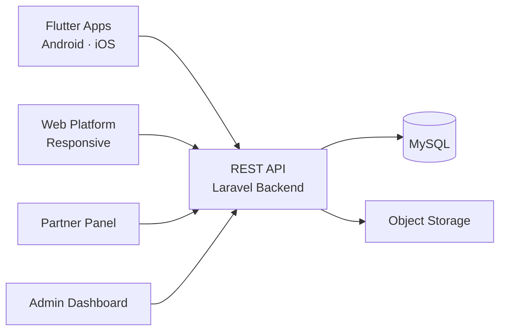

# Astrotalk Clone — White-Label Solution by Miracuves

---

## Table of Contents

1. [Who Is This For?](#who-is-this-for)
2. [How It Works](#how-it-works)
3. [Core Features](#core-features)
4. [Architecture](#architecture)
5. [Revenue Streams](#revenue-streams)
6. [What's Included](#whats-included)
7. [Deployment Timeline](#deployment-timeline)
8. [Why Not Build From Scratch?](#why-not-build-from-scratch)
9. [Market Opportunity](#market-opportunity)
10. [Client Testimonials](#client-testimonials)
11. [FAQ](#faq)
12. [Resources](#resources)
13. [About Miracuves](#about-miracuves)

## Live Demos

| Environment | URL | What you can test |
|---|---|---|
| Web Platform | [mxastro.mimeld.com](https://mxastro.mimeld.com) | Full experience in the browser |
| Mobile App (Android) | [mas.mimeld.com](https://mas.mimeld.com) | Browse, transact, engage |
| Admin Dashboard | [Solution page → Demo](https://miracuves.com/astrotalk-clone/#demo) | Users, content, plans, analytics |

Demo credentials: [miracuves.com/astrotalk-clone -> Demo section](https://miracuves.com/astrotalk-clone/#demo)

## What Makes This Astrotalk Clone Different

<!-- TODO: fill 3-5 vertical-specific differentiators -->

## Who Is This For?

| Buyer Type | Use Case |
|---|---|
| Startup Founders | Launch an astrology consulting brand |
| Astrologers / Gurus | Build your personal brand and client base |
| Agencies / Resellers | White-label and deliver to your own clients |
| Wellness Platforms | Add astrology to an existing wellness offering |

---

## How It Works

1. Customer browses astrologer profiles and reads ratings and reviews
2. Customer selects a consultation type (video call, chat, or report)
3. Per-minute billing starts when the astrologer accepts the session
4. The astrology engine generates kundli and horoscope data in real time
5. Session ends; payment is settled from the customer wallet
6. Platform records the transaction and pays the astrologer minus commission

---

## Core Features

### Customer App
- Browse astrologer profiles with ratings, reviews, and specializations
- Live video call consultation with HD streaming
- Chat consultation with instant messaging and typing indicators
- Per-minute billing with real-time cost display
- Kundli generation and detailed horoscope reports
- Matchmaking with compatibility scoring
- Wallet, card, UPI, and in-app payments
- Consultation history, recordings, and receipts

### Astrologer App
- Set online status, availability hours, and consultation rates
- Accept video, voice, or chat consultations
- Real-time earnings tracker with per-minute billing
- Profile management with certifications and specialties
- Schedule management and booking calendar

### Admin Panel
- Astrologer verification and document approval workflow
- Commission structure configuration per astrologer
- Real-time monitoring of active consultations
- Revenue analytics and payout processing
- User support ticket and dispute resolution system

---

## Advanced Features

The platform integrates AI-powered features that reduce manual overhead and capture revenue opportunities:

- **AI Kundli Engine** - Automatic birth chart calculation with detailed planetary interpretations
- **AI Horoscope Generator** - Personalized daily, weekly, and monthly horoscopes
- **AI Compatibility Scoring** - Algorithmic matchmaking based on kundli matching parameters

---

## Apps and Web Panels

| Module | Description |
|---|---|
| Customer App (iOS + Android) | Browse, video call, chat, kundli, payments |
| Astrologer App (iOS + Android) | Consultations, earnings, availability, profile |
| Admin Web Panel | Users, astrologers, commissions, analytics |

---

## Architecture

**Stack:**

| Layer | Technology |
|---|---|
| Mobile Apps | Flutter (iOS + Android, single codebase) |
| Backend API | Node.js + Express |
| Database | MongoDB |
| Real-time | WebSockets (Socket.io) |
| Video/Voice | Agora SDK / Twilio |
| Payments | Stripe, Razorpay, PayPal |
| Notifications | Firebase Cloud Messaging (FCM) |
| Cloud Hosting | AWS / DigitalOcean / Contabo VPS |
| Admin Panel | React.js |

---

## Revenue Streams

The platform is engineered to generate revenue from day one through multiple complementary channels:

- **Commission per consultation** - take 15-30% from each session
- **Subscription plans** - premium astrologer profile listings
- **Report purchases** - paid kundli and horoscope report downloads
- **Featured placements** - astrologers pay for top placement in search

---

## Security and Compliance

- OTP-based authentication
- SSL/TLS encrypted API communication
- GDPR-ready data handling

---

## What's Included

| Plan | Price | What You Get |
|---|---|---|
| Standard | **$3,099** | Complete source code, all apps, admin panel, rebranding, 1 year updates |
| Enterprise | Custom Quote | Everything in Standard + custom features, multi-region, priority support |

**What is included:**

- Customer App (iOS + Android)
- Astrologer App (iOS + Android)
- Admin Web Panel
- Full Source Code
- Complete Rebranding (your logo, colors, app name)
- Server Deployment
- App Store and Google Play Submission Support
- 60 Days Free Bug Support
- Free 1-Year Updates

---
**Pricing:** from **$3,099** — transparent on the [solution page](https://miracuves.com/astrotalk-clone/#pricing).

## Deployment Timeline

| Day | Milestone |
|---|---|
| Day 1 | Server setup, environment configuration, initial deployment |
| Day 2 | White-labeling - app name, logo, colors, splash screens |
| Day 3 | Payment gateway integration + third-party API configuration |
| Day 4 | Custom feature implementation (if applicable) |
| Day 5 | QA, testing, bug fixes across all panels |
| Day 6 | App Store + Google Play submission + Go-live |

> **Average go-live: 6 business days from payment confirmation.**

---

## Why Not Build From Scratch?

| Factor | Build from Scratch | Miracuves Solution |
|---|---|---|
| Time to Launch | 6-12 months | 6 days |
| Development Cost | $60,000-$150,000 | From $3,099 |
| Source Code Ownership | Yes | Yes |
| Customization | Full | Full |
| Post-Launch Support | Depends on team | 60 days included |
| Risk | High | Low |

---

## Market Opportunity

| Metric | Data |
|---|---|
| Global Astrology Market (2024) | $12 billion |
| Projected Market Size (2031) | $22 billion |
| CAGR | ~8.5% |
| Key Growth Markets | India, USA, UK, UAE, Southeast Asia |
| Active Astrologers on Leading Platforms | 15,000+ |

> Source: Statista, Grand View Research, Allied Market Research

---

## Successful Verticals

- Vedic astrology video consultation platforms
- Tarot card reading and psychic consultation apps
- Numerology and palmistry services
- Face reading and birth chart analysis platforms

---

## Client Testimonials

> *"The video call quality is excellent. Our astrologers love the per-minute billing, and users trust the platform."*
> - CEO, Astrology Startup

---

## FAQ

**How much does an Astrotalk clone cost?**
A white-label Astrotalk clone from Miracuves starts at $3,099 with complete source code ownership.

**Does it support live video calls?**
Yes. HD video calls with per-minute billing are built in.

**Can astrologers set their own rates?**
Yes. Each astrologer can set their own consultation rates per minute.

**Do I get the source code?**
Yes. Complete source code ownership is included.

**How long does it take to launch?**
6 business days from payment confirmation.

---

## Related Solutions

Explore our other white-label clone solutions:

- [AstroSage Clone - Astrology Reports](https://github.com/Miracuves-Solutions/AstroSage-Clone)
- [Cafe Astrology Clone - Horoscope](https://github.com/Miracuves-Solutions/CafeAstrology-Clone)
- [Kundli App Clone - Astrology Reports](https://github.com/Miracuves-Solutions/Kundli-Clone)

---

## Resources

- [Full Solution Page](https://miracuves.com/astrotalk-clone/) — features, pricing, demos, FAQ

## Get Started

**Ready to launch your astrology consulting platform?**

| Channel | Link |
|---|---|
| Full Solution Page | [miracuves.com/astrotalk-clone](https://miracuves.com/astrotalk-clone/) |
| Email | info@miracuves.com |
| WhatsApp | [+91 98300 09649](https://wa.me/919830009649) |
| Book a Call | [Free Consultation](https://miracuves.com/contact/) |

---

## About Miracuves

**Miracuves Solutions Pvt. Ltd.** is a Mumbai-based software company specializing in white-label clone app solutions across 12+ industries.

- 90+ ready-to-deploy solutions
- 6-day delivery guarantee
- 60+ engineers on staff
- 3,900+ apps delivered
- Full source code ownership
- Clients across 40+ countries including India and USA

[Explore all 90+ solutions at miracuves.com](https://miracuves.com)

---

## Disclaimer

This product is independently developed by Miracuves. All product names, logos, and brands are property of their respective owners. Use of these names does not imply endorsement.

---

*(c) 2026 Miracuves Solutions Pvt. Ltd. | Mumbai, India*
*This repository contains product documentation only - no proprietary source code is published here.*

*Keywords: astrotalk clone, astrotalk script, white label solution, laravel flutter app, clone script*

---

### Note on This Repository

This repository is a product overview. The full source code is delivered to clients on purchase. For a hands-on evaluation, use the live demos above; credentials are public on the solution page.

<!--
=========================================================
GENERATED FROM MIRACUVES NETFLIX-CLONE README TEMPLATE
Canon: 6 working days, from $2,799 floor, 60 days support + 12 months updates.
Never use 3 days. See https://miracuves.com/facts/ for audited claims.
=========================================================
-->
