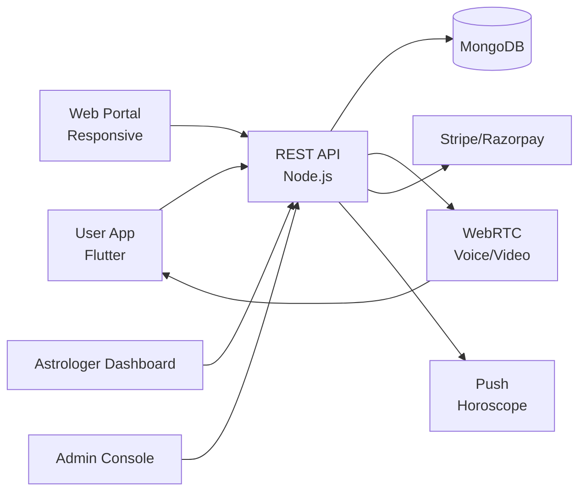

# Astrotalk Clone — White-Label Astrology Consultation Platform by Miracuves

**MXAstro** is a production-ready, white-label Astrotalk clone: a complete astrology consultation platform with chat, call, kundli, and admin console — delivered with **100% source code ownership** in **6 working days**.

> 🔮 **See it running before you talk to anyone.** Live user app, astrologer dashboard, and admin console — demo credentials are printed on the [solution page](https://miracuves.com/astrotalk-clone#demo). No sales call required.

---

## 🚀 Live Demos

| Environment | URL | What you can test |
|---|---|---|
| 📱 User App | [mas.mimeld.com](https://mas.mimeld.com) | Book consultations, chat, call, horoscope, wallet |
| 🌐 Web Portal | [mxastro.mimeld.com](https://mxastro.mimeld.com) | Full user experience in the browser |
| 🔮 Astrologer Dashboard | [Solution page → Demo](https://miracuves.com/astrotalk-clone#demo) | Schedule, customers, earnings, payouts |
| 🛠️ Admin Console | [Solution page → Demo](https://miracuves.com/astrotalk-clone#demo) | Astrologers, sessions, content, analytics |

Demo credentials for all environments: **[miracuves.com/astrotalk-clone → Demo section](https://miracuves.com/astrotalk-clone/#demo)**

---

## ✨ What Makes This Astrotalk Clone Different

Most astrology scripts stop at "chat with an astrologer." This platform ships with the features that actually run an astrology *business*:

- **Multi-Modal Consultations** — chat, voice, video — billing by minutes, with auto-routing to astrologer's preferred mode
- **Kundli & Matchmaking** — Vedic chart generation, dosha analysis, and matchmaking reports — same depth as Astrotalk & AstroVed
- **Daily Horoscope Engine** — per-sign content with auto-publish via push — keeps users returning daily
- **Wallet + Coin System** — prepaid wallet, gift cards, referral bonuses — what drives LTV in astrology apps
- **Astrologer Tier Programs** — automatic level-up by rating + volume (Rising Star → Top Astrologer → Verified Pro) — mirrors Astrotalk's tier program

## 📦 Core Features

**User:** search astrologers · instant chat & call consultations · daily horoscope · kundli · matchmaking · wallet · reviews · reminders

**Astrologer:** profile & specialisations · schedule management · chat/call inbox · earnings dashboard · payout requests · reviews · analytics

**Admin:** astrologer verification · session monitoring · commission engine · content moderation · analytics reports

## 🏗️ Architecture

**Stack:** Flutter mobile apps (Android + iOS) · Node.js backend · MongoDB for chat/consult records · WebRTC for live consultations · Stripe, Razorpay, PayPal, regional gateways

## 📋 What’s Included

- ✅ Full source code — backend, web, mobile apps, panels (no encryption, no license locks)
- ✅ Deployment to your servers & app store submission assistance
- ✅ Your branding — white-label rename, logo, colors, domain
- ✅ 60 days post-launch support + 12 months of free updates
- ✅ Documentation & handover

**Pricing:** from **$3,099**, transparent on the [solution page](https://miracuves.com/astrotalk-clone/#pricing) — no "contact us for quote" games.

## 🆚 Why Not Build From Scratch?

Custom astrology platforms run $50k–$200k and 3–7 months. A proven white-label base gets you to market in 6 working days for a fraction of that, with your budget preserved for astrologer onboarding and performance marketing.

## 📚 Resources

- 📖 [Astrotalk Clone — Full Solution Page](https://miracuves.com/astrotalk-clone) (features, pricing, demos, FAQ)
- 💰 [How Much Does an Astrology App Cost in 2026?](https://miracuves.com/astrotalk-clone#pricing) pricing breakdown & what's included
- 📝 [Best Astrotalk Clone Script in 2026](https://miracuves.com/astrotalk-clone/blog/) features, pricing & launch guide
- 🧠 [Astrologer Onboarding: How Astrotalk Built Its Network](https://miracuves.com/astrotalk-clone/blog/) recruitment, retention, payouts
- ✅ [Miracuves Facts & Claims Ledger](https://miracuves.com/astrotalk-clone/facts/) every claim we make, verified

## 🏢 About Miracuves

[Miracuves Solutions](https://miracuves.com) builds white-label clone apps and custom software from Mumbai, India — 90+ ready-made solutions, live demos for every product, transparent pricing, and delivery in 6 working days. Operating since 2010.

**Talk to us:** [WhatsApp](https://wa.me/919830009649) · [Schedule a consultation](https://miracuves.com/schedule-consultation/) · [miracuves.com](https://miracuves.com)

---

### ⚠️ Note on This Repository

This repository is a product overview. The full source code is delivered to clients on purchase — see [what’s included](https://miracuves.com/astrotalk-clone/#included). For a hands-on evaluation, use the live demos above; credentials are public on the solution page.

*Keywords: astrotalk clone, astrotalk clone script, astrology app, online astrology, kundli, white label astrology, Flutter astrology app, Node.js astrology*

---

<!--
══════════════════════════════════════════════════
TEMPLATE VARIABLE KEY — auto-generated from Netflix-Clone pattern
══════════════════════════════════════════════════
{APP_NAME}        Astrotalk Clone
{MX_NAME}         MXAstro
{CATEGORY}        Astrology Consultation Platform
{DEMO_WEB}        mxastro.mimeld.com
{PRICE}           $3,099
{SLUG}            astrotalk-clone
{SOLUTION_URL}    https://miracuves.com/astrotalk-clone/
{VERTICAL}        astrology

See /tmp/verticals/astrology.txt for the vertical config used to generate this README.
══════════════════════════════════════════════════
-->